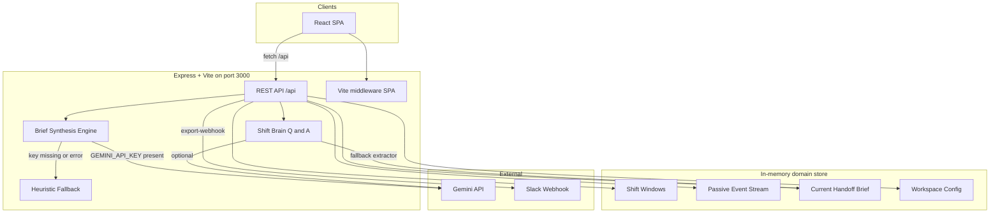
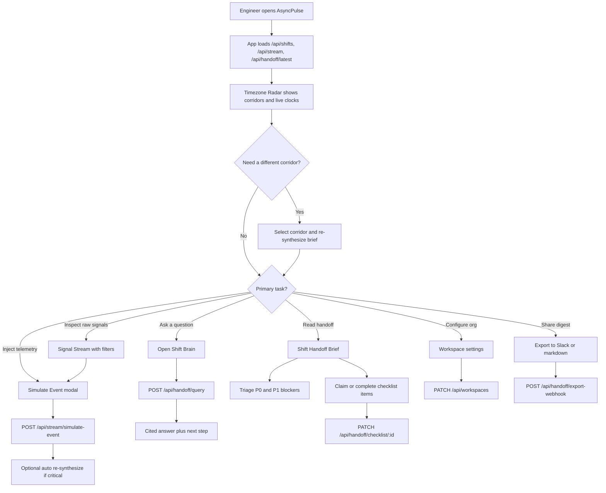

# AsyncPulse

**Autonomous Cross-Timezone Engineering Handoff Orchestrator**

AsyncPulse passively synthesizes Git commits, pull requests, Slack threads, and CI/CD activity into an actionable shift brief. Oncoming engineers log in, read one digest, and start work without a standup.

---

## Problem

Distributed engineering teams spanning US Pacific, India, and EMEA lose hours every day at shift boundaries.

| Pain | What happens in practice |
|------|--------------------------|
| Context loss | Offcoming engineers dump unstructured notes, or nothing at all |
| Standup tax | Oncoming leads spend 30-60 minutes reconstructing what broke overnight |
| Sleep interruption | Offcoming staff get paged for issues that did not need a wake-up |
| Hidden blockers | Broken CI, stalled PRs, and unresolved Slack threads stay buried until someone asks |
| Decision re-litigation | Architecture choices made at 17:00 PT get reopened at 09:00 IST |
| No shared health signal | There is no single score for whether the handoff is safe |

The cost compounds across seats. A 48-person distributed org burning 15 hours per engineer per month on handoff reconstruction wastes hundreds of hours and tens of thousands of dollars.

---

## Solution

AsyncPulse is a single-port web application that sits on top of existing engineering telemetry.

1. **Passive ingestion** — Git, PRs, Slack, Discord, Jira, and CI/CD events stream in without requiring developers to write standup updates.
2. **Shift radar** — Live clocks and corridor status for US Pacific, India (IST), and EMEA, including overlap windows.
3. **Handoff brief** — One executive digest per corridor: health score, P0/P1 blockers, code velocity, key decisions, and a morning checklist.
4. **Shift Brain** — Grounded Q&A over the latest brief and event stream so oncoming engineers can ask "why is CI red?" instead of hunting logs.
5. **Sleep safeguards** — Explicit escalation policy so offcoming leads are only woken for true Sev-0 events.
6. **Workspace & export** — Seat/privacy configuration, Slack webhook dispatch, and markdown export of the brief.

Gemini is used when `GEMINI_API_KEY` is present. If the key is missing or the model call fails, a heuristic synthesizer still produces a valid brief so the product never blocks on AI availability.

---

## Benefits

- **Faster start of shift** — Oncoming leads get blockers, PRs, and decisions in one view.
- **Fewer sleep pages** — Escalation criteria and waking windows are part of every brief.
- **No extra process** — Signals are collected from tools teams already use.
- **Measurable ROI** — Seat pricing and hours-saved math are visible in workspace settings (48 seats x $6 = $288/mo vs. ~720 recovered engineering hours).
- **Privacy-aware** — Default mode is metadata and diffs only; full-text redaction is available.
- **Resilient** — API contracts, input sanitization, and AI fallback keep the app usable without Gemini.

---

## Architecture



### Request path

| Layer | Role |
|-------|------|
| `index.html` + `src/main.tsx` | React 19 SPA entry |
| `src/App.tsx` | Loads shifts, stream, and latest brief; owns tabs and modals |
| `server.ts` | Express API, synthesis, Q&A, checklist, workspace, webhook |
| `src/types.ts` | Shared TypeScript contracts for frontend and backend |
| Vite middleware | Dev SPA serving; production uses `dist/` static files |

Frontend and backend share one port. The SPA calls `/api/*` on the same origin, so no CORS split is required in preview.

---

## User Flow



### Typical oncoming shift

1. Open the app and confirm the active corridor (for example SF to Bengaluru).
2. Read the executive summary and health score.
3. Work P0 blockers first, then the action checklist.
4. Ask Shift Brain about Redis, Stripe PR #418, or sleep policy if context is unclear.
5. Claim checklist items so the rest of the shift does not duplicate work.
6. Export the brief to `#eng-handoffs-apac` when the overlap window closes.

---

## SDLC

```mermaid
flowchart LR
  subgraph Plan["1. Plan"]
    Req["Distributed handoff problem"]
    Scope["Corridors, briefs, stream, Q and A"]
  end

  subgraph Design["2. Design"]
    Types["Shared types in src/types.ts"]
    API["REST contracts under /api"]
    UX["Radar, brief, stream, modals"]
  end

  subgraph Build["3. Build"]
    FE["React 19 + Tailwind UI"]
    BE["Express synthesis and Q and A"]
    AI["Gemini with heuristic fallback"]
  end

  subgraph Test["4. Test"]
    TDD["tests/app.test.ts 29 cases"]
    Lint["tsc --noEmit"]
    Edge["Empty body, NaN seats, invalid enums"]
  end

  subgraph Release["5. Release"]
    Dev["npm run dev on port 3000"]
    Prod["vite build plus esbuild server"]
  end

  subgraph Operate["6. Operate"]
    Ingest["Passive event ingest"]
    SynthRun["Scheduled or on-demand synthesis"]
    Sleep["Sleep-safe escalation"]
  end

  Plan --> Design --> Build --> Test --> Release --> Operate
  Operate -->|"new signals and corridors"| Plan
```



| Phase | What this repo implements |
|-------|---------------------------|
| Plan | Problem framed as lost overlap time and unstructured handoffs |
| Design | Domain model: `ShiftWindow`, `PassiveEvent`, `HandoffBrief`, `WorkspaceConfig` |
| Build | SPA + Express on one process; Gemini optional |
| Test | 29 TDD cases covering APIs, sanitization, ROI math, and health bands |
| Release | `npm run dev` for local/preview; `npm run build` / `npm start` for production |
| Operate | Simulate events, re-synthesize, export webhooks, update seats/privacy |

---

## Features

- Timezone radar with live PT / IST / GMT clocks and overlap remaining
- Handoff brief: health score, blockers, PRs, decisions, checklist, sleep safeguards
- Passive signal stream with source, urgency, and text filters
- Event simulation for CI crashes, PRs, commits, and Slack escalations
- Shift Brain Q&A grounded in the current brief and event log
- Checklist claim / complete with optimistic UI
- Workspace seat calculator and privacy mode
- Slack/Discord webhook export and markdown copy

---

## Tech Stack

| Area | Choice |
|------|--------|
| UI | React 19, Tailwind CSS 4, Lucide icons, Motion |
| Bundler | Vite 6 |
| Server | Express 4 + tsx |
| Language | TypeScript 5.8 |
| AI | `@google/genai` (Gemini), heuristic fallback |
| Tests | Node assert + fetch against live `/api` |

---

## API

| Method | Path | Purpose |
|--------|------|---------|
| GET | `/api/shifts` | Shift windows, server time, workspace config |
| GET | `/api/stream` | Passive events; query `source`, `urgency`, `limit` |
| POST | `/api/stream/simulate-event` | Ingest a simulated telemetry event |
| GET | `/api/handoff/latest` | Current `HandoffBrief` |
| POST | `/api/handoff/synthesize` | Rebuild brief for a `shiftWindowId` |
| POST | `/api/handoff/query` | Shift Brain Q&A |
| PATCH | `/api/handoff/checklist/:id` | Complete or claim a checklist item |
| PATCH | `/api/workspaces` | Seats, privacy, repos, channels |
| POST | `/api/handoff/export-webhook` | Dispatch brief snippet to a channel |

---

## Project Structure

```text
.
├── index.html
├── server.ts              Express API + Vite middleware
├── src/
│   ├── App.tsx            Shell, data loading, tabs
│   ├── main.tsx
│   ├── types.ts           Shared domain types
│   ├── index.css
│   └── components/
│       ├── TimezoneRadar.tsx
│       ├── HandoffBriefView.tsx
│       ├── PassiveStreamFeed.tsx
│       ├── ShiftBrainQA.tsx
│       ├── SimulateEventModal.tsx
│       ├── WorkspaceModal.tsx
│       ├── ExportModal.tsx
│       └── Toast.tsx
├── tests/app.test.ts
├── package.json
├── vite.config.ts
└── .env.example
```

---

## Run Locally

Prerequisites: Node.js 18+.

```bash
# Install dependencies
npm install

# Optional: Gemini key for live synthesis and Shift Brain
# Copy .env.example to .env.local and set GEMINI_API_KEY

# Start the combined frontend + API server
npm run dev
```

The app listens on `http://localhost:3000`.

Without `GEMINI_API_KEY`, synthesis and Q&A use the built-in heuristic/fallback path. The UI and APIs still work.

### Scripts

```bash
# Typecheck
npm run lint

# Integration tests (server must be running on port 3000)
npm test

# Production build
npm run build

# Production start
npm start
```

---

## Verification

Verified on this workspace:

- Typecheck: `npm run lint` (`tsc --noEmit`) passed
- Tests: 29 / 29 passed in `tests/app.test.ts`
- Coverage includes shift radar, stream filters, ingest sanitization, brief contracts, synthesis fallbacks, Shift Brain, checklist 404s, workspace clamping, webhook export, and ROI math
- Dev server: `npm run dev` on port 3000
